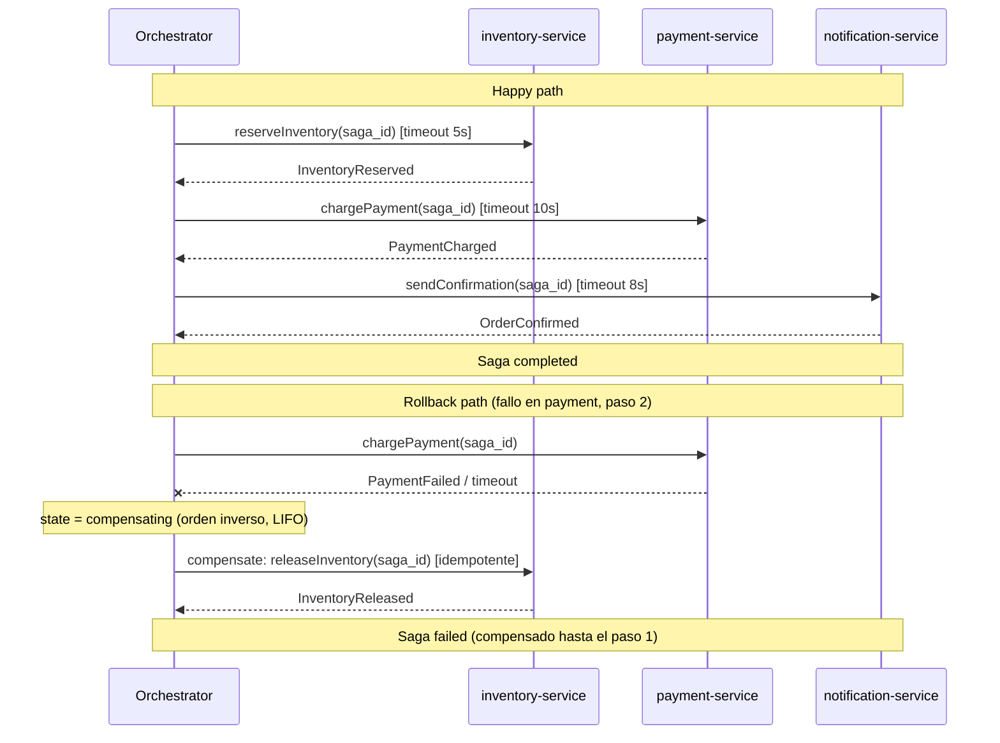

# /saga-design

Descompone un flujo de negocio distribuido en pasos atómicos, diseña compensaciones
idempotentes, genera el diagrama Mermaid (happy path + rollback path), los handlers con
idempotency key, el **Outbox Pattern** (no-opcional) y los tests de compensación con
escenarios de crash. Alimenta la capa **CASTLE C**.

## Instrucciones

1. Invocar el skill `saga-design` usando la herramienta Skill
2. Argumentos:
   - `flow-description` (posicional): descripción en lenguaje natural del flujo de negocio
   - `--style <orchestration|choreography>`: default `orchestration` (más debuggeable; un coordinador central)
   - `--tech <temporal|step-functions|camunda|custom>`: default `custom` (state machine manual con outbox + polling/CDC)
   - `--services <a,b,c>`: lista de servicios involucrados (si se omite, se infieren del flow-description)
3. Seguir todas las fases del skill en orden:
   - Analyze flow → Design steps → Design compensations → Generate Mermaid → Generate code → Generate tests → CASTLE C → Session → Guide
4. Agentes coordinados: @architect (principal: descompone el flujo, elige style/tech), @api (define eventos y payloads), @qa (cobertura de compensaciones y crash scenarios)
5. IMPORTANTE: el **Outbox Pattern es no-opcional**. El evento se publica en la MISMA transacción local que el cambio de estado del paso — nunca `commit` + `publish` separados (dual-write).
6. IMPORTANTE: el diagrama Mermaid DEBE incluir happy path Y rollback path. Cada compensación DEBE ser idempotente (segura ante doble ejecución con el mismo `saga_id`).

Si no se da `flow-description` ni se puede inferir el flujo, el skill solicita la descripción
al usuario antes de continuar. Si el flujo toca un solo servicio, el skill sugiere una
transacción ACID local en vez de un saga.

## Ejemplo completo — Saga de orden e-commerce (3 servicios)

```
/saga-design "crear orden: reservar inventario + cobrar pago + enviar confirmación" \
  --style orchestration --tech custom \
  --services inventory-service,payment-service,notification-service
```

### Pasos y compensaciones (tabla generada)

| # | Servicio | Acción forward | Evento publicado | Compensación (idempotente) | Timeout |
|---|----------|----------------|------------------|----------------------------|---------|
| 1 | inventory-service | Reservar stock del item | `InventoryReserved {saga_id, item_id, qty}` | Liberar la reserva por `saga_id` (noop si ya liberada) | 5s |
| 2 | payment-service | Cobrar al cliente | `PaymentCharged {saga_id, amount, charge_id}` | Reembolsar el cobro por `saga_id`/`charge_id` (noop si ya reembolsado) | 10s |
| 3 | notification-service | Enviar email de confirmación | `OrderConfirmed {saga_id, order_id}` | **Paso pivot**: el email ya despachado no se "des-envía" → acción correctiva = enviar email de cancelación | 8s |

### Diagrama Mermaid (happy path + rollback path)



### Outbox Pattern (no-opcional, en cada paso)

```
BEGIN TX (DB del servicio)
  UPDATE estado_negocio ...                                   -- el efecto del paso
  INSERT INTO outbox (saga_id, event, payload, created_at)    -- el evento, MISMA TX
COMMIT
-- relay (polling o CDC) lee outbox y publica al broker → at-least-once
-- consumidor idempotente (inbox/dedupe por saga_id + event)
```

### Outputs generados

- `.king/saga/order-creation.saga.md` — diseño y tabla de pasos
- `.king/saga/order-creation.mermaid.md` — diagrama happy path + rollback path
- `src/saga/order-creation/handlers.{ext}` — handlers forward + compensación con idempotency key + outbox
- `tests/saga/order-creation.saga.test.{ext}` — happy path, compensación por paso, idempotencia (doble revert), crash (re-publish desde outbox), timeout
- `.king/saga/castle-c-summary.md` — resumen CASTLE C (veredicto PASS|CONDITIONAL)
